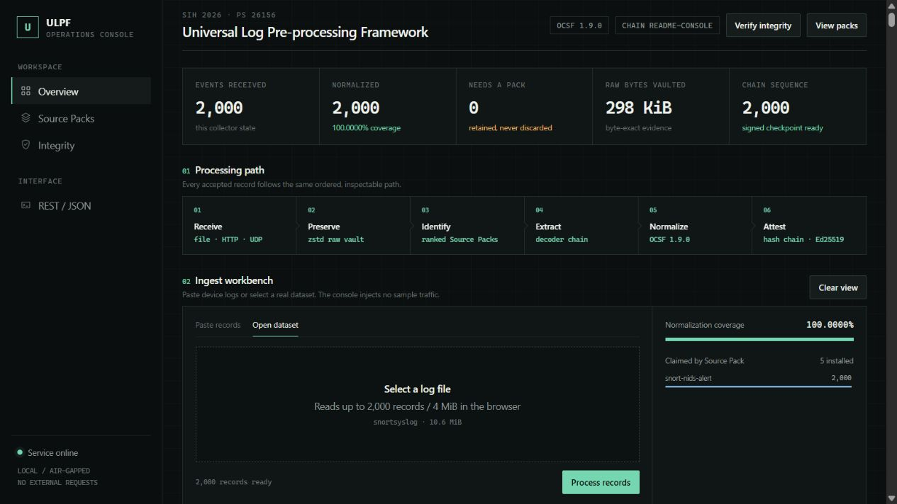
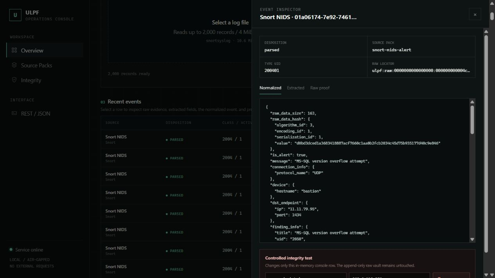
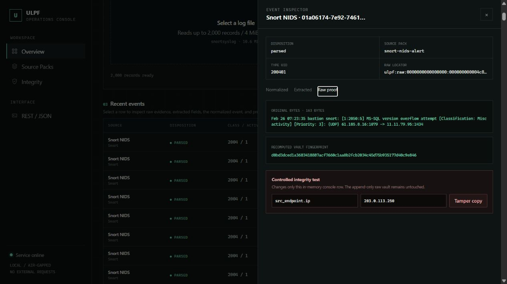
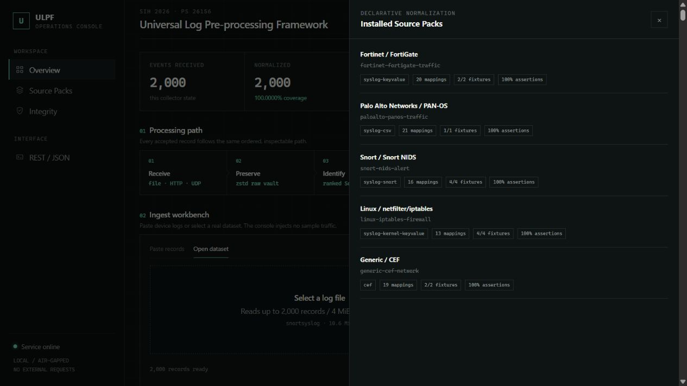
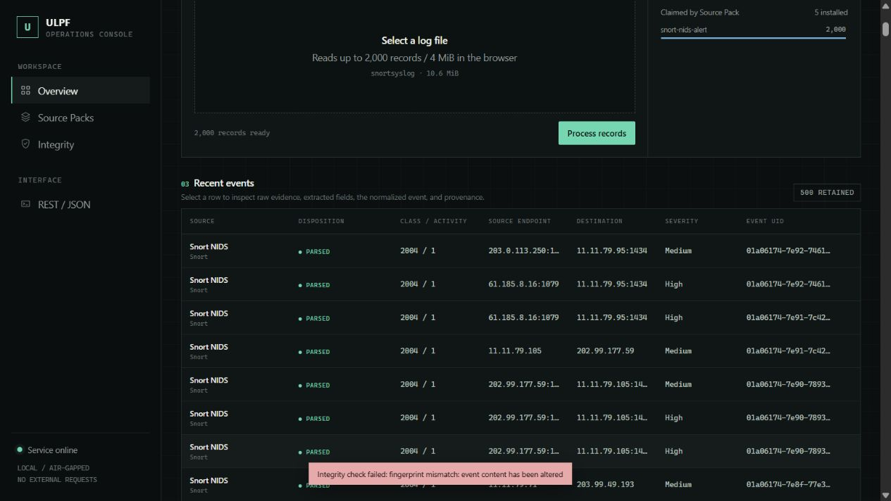

# ULPF — Universal Log Pre-processing Framework

> SIH 2026 · Problem Statement 26156 · NTRO · Blockchain & Cybersecurity

ULPF converts heterogeneous perimeter-security logs into a common OCSF 1.9
representation while retaining the exact input bytes and a verifiable chain of
custody. It is an offline-first Rust prototype built for the Smart India
Hackathon 2026.



This is not a screen filled with planted demo events. The screenshot above was
captured after the browser submitted 2,000 unmodified records from the public
Honeynet Project Snort corpus through the same vault, source-pack, OCSF, and
integrity pipeline used by the CLI.

## Problem statement

Security teams receive logs from firewalls, IDS/IPS products, gateways, and
other perimeter devices in incompatible formats. Each integration usually
needs a custom parser, and transformations can discard fields or sever the
connection to the original evidence. ULPF addresses that problem with one
lossless preprocessing layer: accept arbitrary records, preserve their bytes,
identify and extract known sources through declarative packs, normalize them to
OCSF, and make every transformation auditable.

### SIH requirement coverage

| Requirement | Current prototype status | Evidence |
|---|---|---|
| Preserve raw event data without loss | Implemented | Append-first compressed vault, byte locator, hash, CRC validation |
| Extract source-specific attributes | Implemented | Decoder chains and source-pack extraction rules |
| Normalize to a common taxonomy | Implemented | OCSF 1.9 event model and vendored schema |
| Trace normalized events to originals | Implemented | `unmapped.ulpf_raw_locator`, content fingerprint, receipt, previous-event link |
| Plug-and-play onboarding | Implemented at restart | Declarative YAML packs with validation and embedded fixtures; hot reload is pending |
| Unified visibility | Implemented | Embedded operator console and event inspector |
| SIEM/data-lake integration | Partial | Streaming NDJSON is ready; native HEC, OpenSearch, Parquet, and Iceberg sinks are planned |
| AI/ML-ready analytics | Partial | Stable structured JSON is available; columnar feature pipeline is planned |
| Reduce parser development effort | Partial | Reusable decoders and scored packs exist; automatic pack drafting is planned |
| Air-gapped deployment | Runtime-ready | No runtime CDN, webfont, telemetry, or network dependency; dependency vendoring for offline compilation is planned |
| Container packaging | Implemented | Multi-stage Dockerfile and hardened Compose service |

## What makes ULPF credible

- **Raw-first, not parse-first.** A record is committed to the vault before its
  normalized row is published. Unknown, malformed, blank, and invalid UTF-8
  records remain recoverable.
- **Integrity that survives restarts.** Ed25519 keys and signed checkpoints are
  persisted per chain. Resume verifies the prior checkpoint instead of silently
  creating a new trust root.
- **Strict source packs.** Unknown YAML properties, unsafe framework paths,
  missing detectors, invalid enum references, and impossible ranges are rejected
  before ingest begins.
- **Real data validation.** Coverage is measured on 556,315 public honeynet
  records. Synthetic logs are used only for repeatable performance tests.
- **No fabricated console feed.** Events enter through file selection, the HTTP
  ingest endpoint, CLI input/stdin, or a real UDP syslog socket.

## Processing model

```text
bytes ──► raw vault ──► identify ──► extract ──► normalize ──► attest ──► NDJSON/API
   │                         │                         │
   │                         └─ no valid pack ───────► dead-letter metadata
   └──────── O(1) retrieval by locator ◄─────────────┘
```

The event receipt records which pack and decoder chain was applied. The OCSF
integrity profile carries the content hash and previous-event link. A signed
checkpoint anchors the current head; verification can therefore detect row
deletion, reordering, substitution, or modification.

See [Architecture](docs/ARCHITECTURE.md) for trust boundaries and data flow.

## Interface evidence

### Inspect a normalized event



The inspector exposes normalized OCSF, extracted source fields, transformation
receipt, and integrity metadata without rendering untrusted event text as HTML.

### Retrieve and prove the original



Raw proof retrieves the precise stored bytes and recomputes the recorded
fingerprint. The CLI can perform the same retrieval with `ulpf raw`.

### Source-pack visibility



Five source packs currently cover Fortinet FortiGate traffic, Palo Alto PAN-OS
traffic, generic CEF, Linux netfilter/iptables, and Snort NIDS.

### Controlled tamper detection



The Tamper action changes only the browser's in-memory copy. Verification
rejects it while the append-only vault remains unchanged.

## Install without setup surprises

### Prerequisites

- Rust 1.85 or newer through [rustup](https://rustup.rs/).
- Windows: Visual Studio Build Tools with **Desktop development with C++**, or a
  working GNU Rust host toolchain.
- Debian/Ubuntu: `build-essential pkg-config cmake`.
- macOS: Xcode Command Line Tools.

No Node.js or frontend build is needed. The console is embedded in the binary.

### Automated setup

Windows PowerShell:

```powershell
Set-ExecutionPolicy -Scope Process Bypass
.\scripts\setup.ps1
```

Linux/macOS:

```bash
chmod +x scripts/setup.sh
./scripts/setup.sh
```

The scripts validate the toolchain, build the locked release, run Rust tests,
and score all source-pack fixtures.

### Manual setup

```bash
git clone <private-repository-url>
cd ulpf
rustup toolchain install stable
cargo build --release --locked
cargo test --workspace --locked
cargo run --locked --quiet -- test --packs packs
```

The first Cargo build downloads locked dependencies. Runtime processing itself
does not need internet access.

## Run it

### Operator console

```bash
./target/release/ulpf serve \
  --packs packs \
  --vault data/console/vault \
  --integrity-dir data/console/integrity \
  --chain console
```

Open <http://127.0.0.1:8787>, select a real `.log` file, and press **Process
file**. Requests are deliberately bounded to 2,000 records and 4 MiB. To expose
the console outside the host, explicitly pass `--host 0.0.0.0`; it has no
built-in authentication, so place it behind an authenticated reverse proxy.

### Normalize a file

```bash
./target/release/ulpf run \
  --packs packs \
  --vault data/run/vault \
  --integrity-dir data/run/integrity \
  --chain example \
  --input testdata/mixed.log \
  --output data/run/events.ndjson \
  --dead-letter data/run/dead-letter.ndjson
```

Expected result: five records received, four parsed, one unidentified and still
vaulted/emitted.

### Verify the signed chain

```bash
./target/release/ulpf verify data/run/events.ndjson \
  --checkpoint data/run/integrity/example.checkpoint.json \
  --public-key data/run/integrity/ed25519-signing.pub
```

Supplying the public key is stronger than trusting a key embedded in an
untrusted checkpoint file.

### Receive UDP syslog

```bash
./target/release/ulpf listen \
  --bind 0.0.0.0:5514 \
  --packs packs \
  --vault data/syslog/vault \
  --integrity-dir data/syslog/integrity \
  --output data/syslog/events.ndjson
```

Port 5514 avoids privileged-port requirements. Configure a test device to send
RFC 3164 or RFC 5424 datagrams to the host. Stop with Ctrl+C.

### Recover original bytes

Copy `unmapped.ulpf_raw_locator` from an emitted event:

```bash
./target/release/ulpf raw --vault data/run/vault "ulpf:raw:<block>:<offset>:<length>"
```

`ulpf raw` writes exactly the stored bytes and does not invent a line ending.

### Docker

```bash
docker compose up --build
```

Compose publishes the console only on `127.0.0.1:8787`, runs as a non-root
user, drops Linux capabilities, enables `no-new-privileges`, and uses a named
volume for vault/checkpoint state.

## Source packs

A pack is a reviewed, testable YAML contract containing source identity,
detectors, decoder steps, OCSF mappings, enums, and fixtures:

```yaml
identity:
  id: fortinet-fortigate-traffic
  vendor: Fortinet
  product: FortiGate
  detect:
    - contains_all: ["devname="]
      contains_any: ['type="traffic"', "type=traffic"]

extract:
  - decoder: syslog
  - decoder: keyvalue

map:
  class_uid: 4001
  activity_id: { from: action, enum: fortigate_action, default: 6 }
  src_endpoint.ip: { from: srcip, observable: ip }
  src_endpoint.port: { from: srcport, as: int }

enums:
  fortigate_action: { accept: 6, deny: 3, close: 2 }
```

Score every pack and its field assertions:

```bash
cargo run --locked --quiet -- test --packs packs
```

Current result: **5 packs, 13/13 fixtures, 100% asserted-field accuracy**.
See [Contributing](CONTRIBUTING.md) before adding or changing a pack.

## Real dataset results

ULPF was evaluated on unmodified Honeynet Project Scan of the Month 30 and 34
material. The raw corpus is not committed; [Dataset protocol](docs/DATASETS.md)
documents acquisition, paths, counts, and reproduction.

| Input | Records | Successfully normalized |
|---|---:|---:|
| SotM30 Linux iptables | 307,524 | 307,504 |
| SotM34 Linux iptables | 179,752 | 179,659 |
| SotM34 Snort NIDS | 69,039 | 69,038 |
| **Combined** | **556,315** | **556,201 (99.9795%)** |

The remaining 114 records were retained rather than discarded: 36 were not
firewall/IDS traffic and 78 did not satisfy extraction rules. On the verified
local corpus (`119,113,071` bytes), the raw vault was `7,479,694` bytes
(approximately **15.9:1** compression) and all originals remained addressable.

The final locked release processed the corpus in `51.545 s`, or **10,793
events/s**, on Windows x86-64 with Rust 1.98.0. This is a single-process local
measurement, not a universal hardware claim; the exact reproduction command is
in [Dataset protocol](docs/DATASETS.md).

Synthetic fixtures from `tools/gen_bench.py` are useful for profiler regression
only; they are never included in the coverage figure above.

## Verification status

- 184 executed Rust tests pass (183 unit/integration cases and one doc test).
- All 13 source-pack fixtures pass with 100% asserted-field accuracy.
- Release build and mixed-stream signed-checkpoint flow pass.
- Browser flow passes with 2,000 real Snort records and no console warnings or errors.
- Vault reads verify header, bounds, decompressed size, and CRC-32.
- Input/output/dead-letter path collisions are rejected before writing.

Run the complete local gate from [Testing](docs/TESTING.md).

## Repository layout

```text
ulpf/
├── .github/              CI, contribution templates, Dependabot
├── crates/               six focused Rust workspace crates
├── docs/                 architecture, datasets, tests, roadmap, evidence
├── packs/                declarative source packs with fixtures
├── schema/ocsf/          pinned upstream OCSF 1.9 schema snapshot
├── scripts/              setup and real-corpus preparation
├── testdata/             small redistributable regression inputs
├── tools/                synthetic benchmark generator
├── Dockerfile
└── compose.yaml
```

## Known limitations

- Only UDP is implemented as a native network receiver; TCP/TLS syslog, Kafka,
  and HTTP bulk clients remain roadmap work.
- NDJSON is the only durable normalized sink.
- Packs reload on process restart, not while ingest is running.
- Five sources are included; FortiGate, PAN-OS, and generic CEF currently rely
  on documentation-derived fixtures rather than publishable vendor corpora.
- The console is an operator prototype and intentionally ships without user
  accounts or authorization.
- A clean online build is reproducible through `Cargo.lock`; dependencies are
  not yet vendored for fully offline compilation.

These constraints are tracked in [Roadmap](docs/ROADMAP.md) and should not be
presented as completed hackathon features.

## Team workflow

1. Create a focused branch: `feature/<topic>` or `fix/<topic>`.
2. Keep commits small and imperative.
3. Run formatting, tests, Clippy, pack scoring, and the release build.
4. Open a pull request using the checklist and attach evidence for UI/parser changes.
5. Require review before merging to `main`.

Security reports follow [SECURITY.md](SECURITY.md), community expectations are
in [CODE_OF_CONDUCT.md](CODE_OF_CONDUCT.md), and implementation guidance is in
[CONTRIBUTING.md](CONTRIBUTING.md).

## License and provenance

ULPF code is licensed under Apache-2.0. The vendored OCSF schema has its own
Apache-2.0 notice and is pinned to version 1.9.0; see
[`schema/ocsf/UPSTREAM.md`](schema/ocsf/UPSTREAM.md) and [NOTICE](NOTICE).
