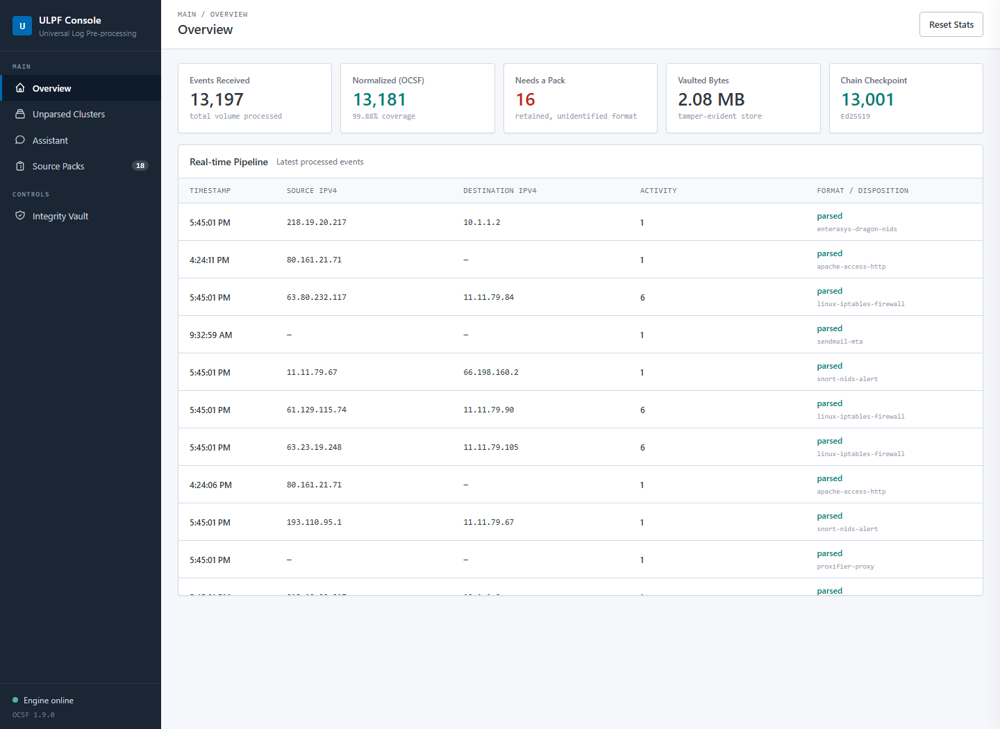
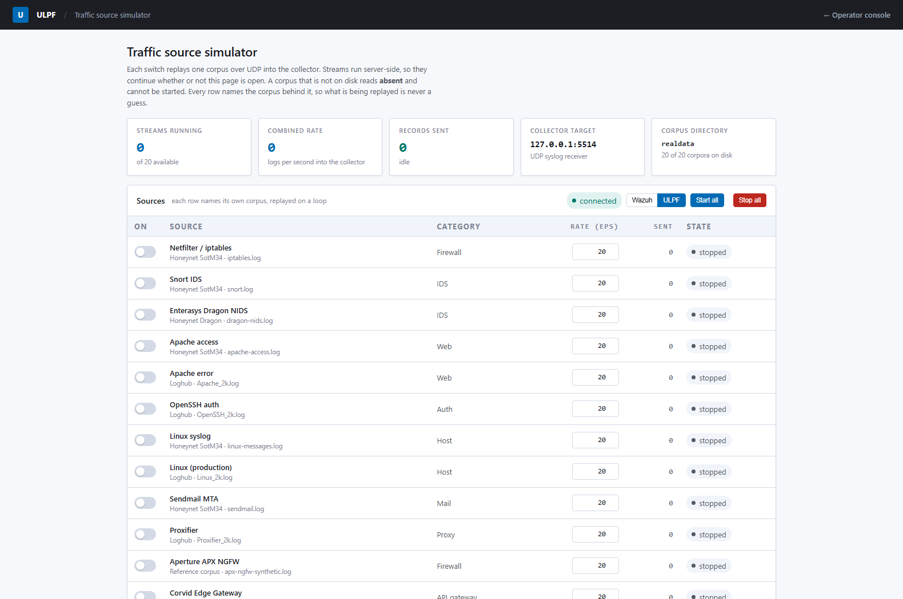
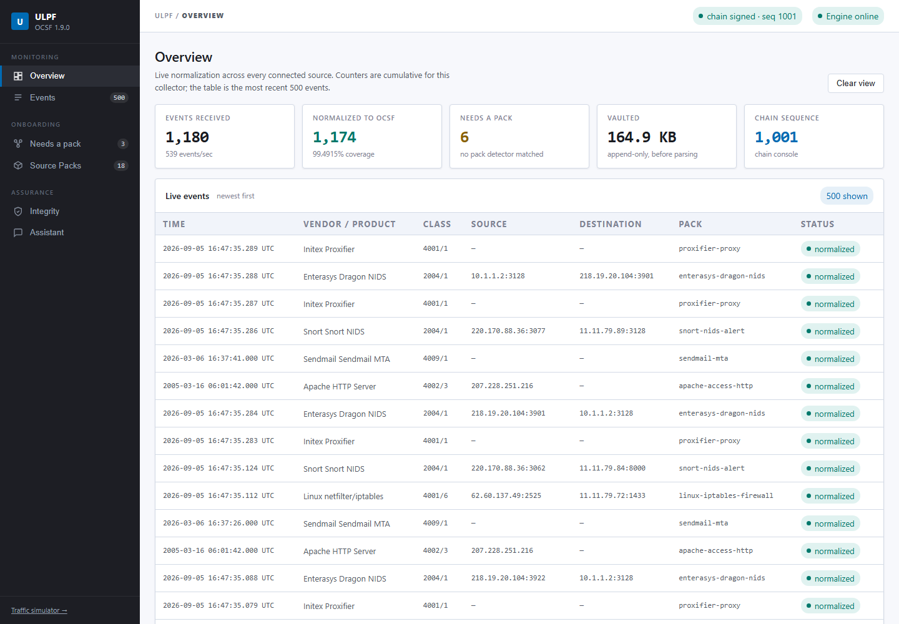
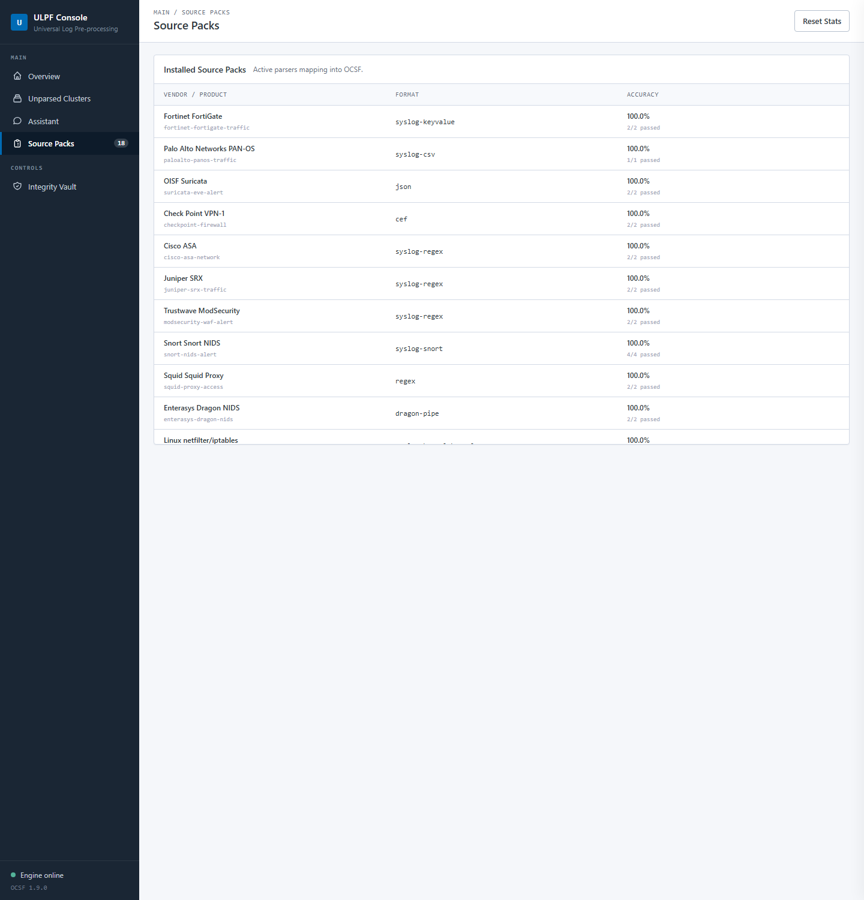
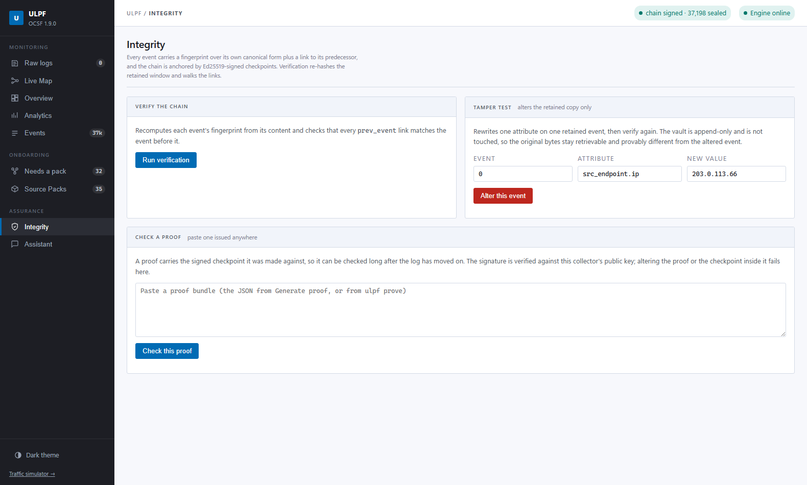
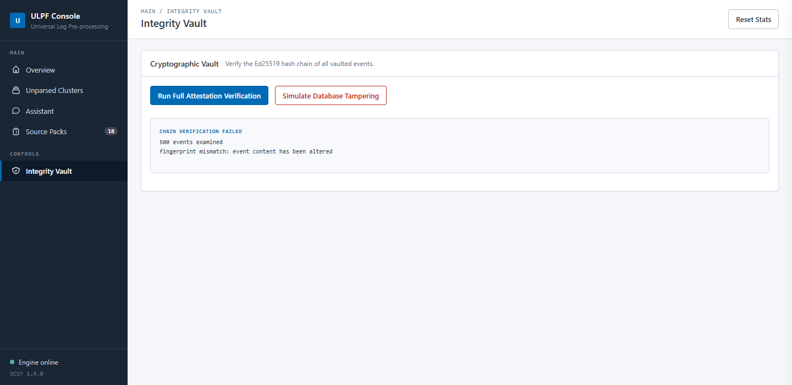
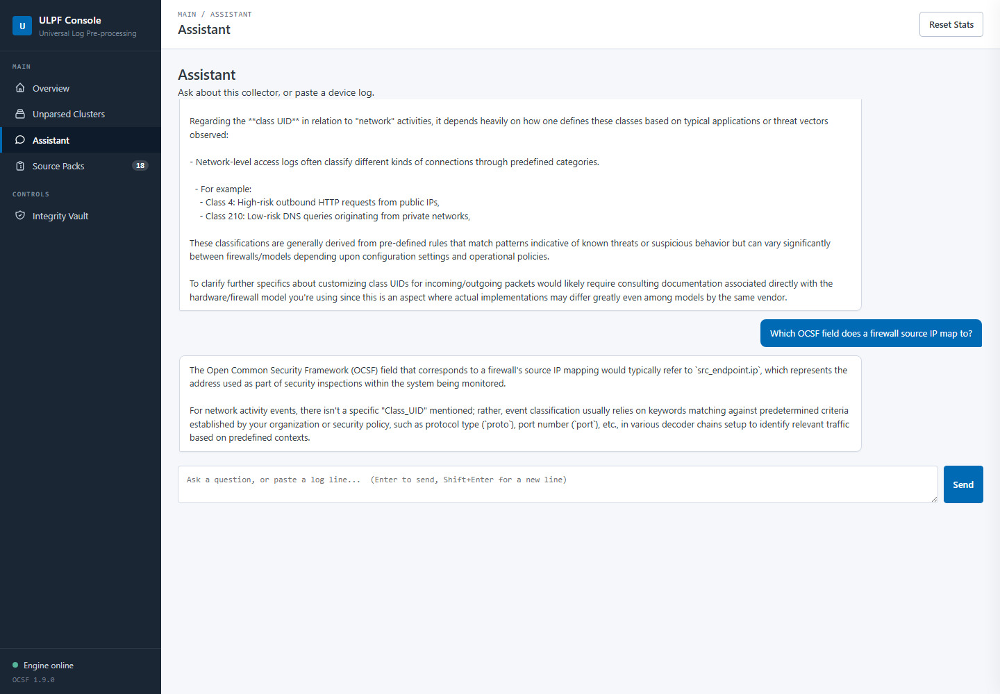

# ULPF — Universal Log Pre-processing Framework

> SIH 2026 · Problem Statement 26156 · NTRO · Blockchain & Cybersecurity

Any log in, OCSF out, nothing lost.

ULPF ingests heterogeneous perimeter-security logs — firewalls, IDS/IPS,
proxies, web servers, mail transfer agents, hosts — and emits a single
[OCSF 1.9](https://schema.ocsf.io/) representation, while keeping the exact
input bytes and a cryptographically verifiable chain of custody over every
record it has seen.

It is written in Rust, runs from a single binary, and needs no network at
runtime: no CDN, no web font, no telemetry, no model API.



Every number in that screenshot came from replaying real public capture data —
Honeynet Project and Loghub — over UDP into the collector. Nothing on this page
is a mock-up, and **no coverage or throughput figure anywhere in this project
comes from synthesised data**.

One synthetic file is committed, and it is labelled as such:
`testdata/mixed.log` mixes eight vendor formats so the pipeline can be tried
without first downloading 200 MB of corpora. It uses RFC 5737 documentation
addresses, is never measured, and never appears in a published number.

---

## Contents

- [The problem](#the-problem)
- [How it works](#how-it-works)
- [What you actually see](#what-you-actually-see)
- [Setup](#setup)
- [Running it](#running-it)
- [Measured results](#measured-results)
- [Requirement coverage](#requirement-coverage)
- [Repository layout](#repository-layout)
- [What is done](#what-is-done)
- [What is next](#what-is-next)
- [Known limitations](#known-limitations)
- [Development](#development)

---

## The problem

A security team receives logs from dozens of vendors in mutually incompatible
formats. Each new device usually means a hand-written parser. Worse, most
normalization pipelines are lossy: they extract the fields someone thought of
in advance and throw the rest away, severing the link between the tidy record
in the SIEM and the original evidence.

That matters most exactly when it matters most — in an investigation, or in
court, where "this is what the device said" has to be provable.

ULPF takes a different position:

1. **Nothing is discarded.** Every record is stored byte-for-byte before
   anything is parsed. An unparsed record is still vaulted, fingerprinted,
   chained, and emitted as valid OCSF carrying its raw text. "Unparsed" is a
   routing decision, never data loss.
2. **Parsers are data, not code.** A new device is a YAML file, not a
   recompile.
3. **Every event is tamper-evident.** Each record carries a fingerprint over
   its own canonical form plus a link to its predecessor, and the chain is
   anchored by periodic Ed25519-signed checkpoints.

---

## How it works

```
    raw bytes                                                   OCSF 1.9 NDJSON
        │                                                              ▲
        ▼                                                              │
  ┌───────────┐   ┌──────────┐   ┌─────────┐   ┌───────────┐   ┌──────────────┐
  │   Vault   │──▶│  Detect  │──▶│ Extract │──▶│  Normalize│──▶│  Attestation │
  │ append-   │   │  which   │   │ decoder │   │  to OCSF  │   │  fingerprint │
  │ only,zstd │   │  pack    │   │  chain  │   │   fields  │   │  + hash chain│
  └───────────┘   └──────────┘   └─────────┘   └───────────┘   └──────────────┘
        │              │                                               │
        │              └── no pack claims it ──▶ Drain clustering ──┐  │
        │                                                           │  │
        └── locator ────────────────────────────────────────────────┼──┘
             (retrieve the original bytes at any time)              │
                                                                    ▼
                                                    unparsed cluster ──▶ draft
                                                    a Source Pack (AI or
                                                    deterministic), review,
                                                    approve, hot-reload
```

**The vault comes first.** Raw bytes are written to an append-only,
zstd-block-compressed store *before* parsing is attempted, and every emitted
event carries a locator back to them. Crash recovery works by scanning block
headers.

**Source Packs** are declarative YAML: how to recognise a format, which decoder
chain to run, how to map extracted fields onto OCSF attributes, plus embedded
fixtures that are executed as tests. Ten decoders ship in the box — `syslog`,
`syslog_rfc3164`, `syslog_rfc5424`, `keyvalue`, `csv`, `cef`, `leef`, `json`,
`xml`, `regex` — and a pack composes them into a chain.

**Integrity** uses the OCSF `record_integrity` profile. Each event's
fingerprint is a hash over its RFC 8785 (JCS) canonical form, computed over the
whole event *including* its chain links but excluding the fingerprint field
itself. Checkpoints are Ed25519-signed. Because BLAKE3 is absent from the OCSF
`algorithm_id` enum, it is declared as `Other(99)` with free-text `algorithm`.

**Unknown formats** are clustered with the Drain algorithm, so a thousand
similar dead-letter lines become one reviewable template rather than a thousand
rows. Every cluster now carries an evidence-based source profile that keeps
three answers separate: observed wire format, inferred source family, and an
exact vendor/product hypothesis only when distinctive literals support one.
Confidence and warnings are shown before generation; anonymous input stays
`Unknown` instead of being given a plausible invented brand.

---

## What you actually see

### Live normalization


Events received, OCSF coverage, records needing a pack, vaulted bytes, and the
chain sequence — over a live table showing which pack claimed each record. The
IP addresses are real: `11.11.79.x` is the Honeynet subnet, and the external
addresses are genuine scan and attack traffic from the capture.

### The traffic simulator (`/dev`)



A control plane for the demo. Each switch replays one **real** public corpus
over UDP at a rate you set. Streams live in the server, so they keep running
whether or not the page is open. A corpus that is not on disk is reported
`absent` and cannot be switched on — there is deliberately no fallback to
invented data.

Use the **ULPF** and **Wazuh** destination buttons to replay the same corpus
into ULPF on UDP 5514 or a local Wazuh 4.x manager on UDP 514. The complete
Windows and Docker procedure is in [WAZUH_INTEGRATION.md](docs/WAZUH_INTEGRATION.md).

### Unparsed clusters and the two generators



Dead-letter records are grouped into templates ranked by volume, each labelled
with a specificity — the share of the template that is still a literal token
rather than a `<*>` wildcard. Two clusters at equal count are not equally
trustworthy: one may have generalized only a trailing timestamp, another may
have merged genuinely different shapes under a loose match until little but
the token count is shared. A low-specificity cluster with a high count is
worth a second look before drafting a pack from it. Each cluster offers two
ways to draft one:

- **AI Copilot** — a local model (Ollama) drafts the pack.
- **Heuristic** — a deterministic, rules-based generator. No model, no GPU,
  works air-gapped.

Both are offered explicitly rather than one hiding behind the other's failure,
because a deployment that forbids an LLM still has to be able to onboard a new
device. The candidate is scored against fixtures built from the actual samples
before anyone is asked to approve it, and the review pane names which generator
produced it. **Nothing activates without human approval.**

### Installed Source Packs



Every loaded pack with its decoder chain and its own fixture score. A pack that
cannot parse its own fixtures does not reach this list.

### Integrity verification



Re-hashes every event in the window and walks the chain links.

### Tamper detection



The tamper test rewrites one attribute on one *retained* event — here a source
IP. The vault is append-only and is not touched, which is the point: the
original bytes stay retrievable and provably different from the altered
record. Verification immediately reports
`fingerprint mismatch: event content has been altered`. This is the core claim
of the project, and it is a live test, not a slide.

### Assistant



A free-form conversation with the local model, given live context: loaded
packs, current coverage, unparsed clusters, and recent events. Paste a device
log and it offers to draft a pack. See [Known limitations](#known-limitations)
for an honest note on answer quality.

---

## Setup

### Requirements

| | |
|---|---|
| Rust | 1.85+ (pinned by `rust-toolchain.toml`) |
| Python | 3.9+, only to fetch corpora and reproduce measurements |
| Disk | ~2 GB for the build, ~150 MB for the corpora |
| Optional | [Ollama](https://ollama.com) for the AI Copilot and Assistant |

No database, no message broker, no container runtime. The console, its CSS and
its JavaScript are compiled into the binary with `include_str!`.

### 1. Build

```bash
git clone https://github.com/D3v4nshPat3l/ULPF.git
cd ULPF
cargo build --release --locked
```

On Windows the GNU toolchain is used, so no Visual Studio Build Tools are
required:

```bash
rustup toolchain install stable-x86_64-pc-windows-gnu
rustup default stable-x86_64-pc-windows-gnu
```

### 2. Verify the build

```bash
cargo test --workspace --release --locked
```

```bash
./target/release/ulpf test --packs packs
```

The second command runs every pack's embedded fixtures. Expect
`35 packs · 75/75 fixtures passed · 100.0% field accuracy`.

After pulling changes, run `cargo build --release --locked` again before
demonstrating anything. `cargo test` builds its own test binaries and leaves
`target/release/ulpf` untouched, so a green test run is not evidence that the
binary you are about to run is current — a stale one fails in ways that look
like broken features rather than an old build.

### 3. Fetch the real corpora

The datasets are not committed: they total ~150 MB, they are independently
available, and vendoring them would silently relicense third-party data.

```bash
python tools/fetch_datasets.py
```

This fetches **every** corpus the coverage table is measured on, into
`realdata`: the Honeynet Project captures (Scan of the Month 30 and 34, the
Dragon NIDS capture, Squid, Blue Coat), the MACCDC 2012 Zeek capture, and all
nineteen corpora in the official Loghub deposit. Roughly 6 GB of archives
expanding to roughly 65 GB on disk, so check the volume has room first.

There is deliberately no size gate. An earlier version defaulted to a ~200 MB
subset, which meant this command produced a corpus set the published table
could not be measured on. Completed files are skipped and partial transfers
resume, so an interrupted fetch restarts by running the same command again.

See [docs/DATASETS.md](docs/DATASETS.md) for full provenance.

### 4. Optional — the local model

```bash
ollama pull qwen2.5:1.5b-instruct
```

ULPF finds it on `http://127.0.0.1:11434` by default. Override with
`ULPF_LLM_ENDPOINT`, `ULPF_LLM_MODEL`, `ULPF_LLM_BACKEND`. Without it,
everything still works; only the AI Copilot and Assistant are unavailable, and
the deterministic generator covers pack drafting.

---

## Running it

### The console

```bash
./target/release/ulpf serve --packs packs --vault data/vault --integrity-dir data/integrity --datasets realdata
```

Open <http://127.0.0.1:8787> for the operator console and
<http://127.0.0.1:8787/dev> for the traffic simulator. Turn on a few sources in
the simulator and watch the console fill.

`serve` also binds a UDP syslog receiver on `0.0.0.0:5514`, so real devices can
point at it directly.

**Console authentication.** Every `/api/*` route requires a bearer token by
default. The first `serve` run generates one, stores it at
`<integrity-dir>/console.token` (owner-only file permissions), and prints it
once:

```
console token (send as `Authorization: Bearer <token>`):
  <64 hex characters>
```

Open the browser console once and paste that token when prompted — it is
kept in that browser's `localStorage` for this origin and attached
automatically after that. From the command line: `curl -H "Authorization:
Bearer <token>" http://127.0.0.1:8787/api/stats` (or the equally-accepted
`-H "X-ULPF-Token: <token>"`). `/healthz` and `/readyz` are deliberately
exempt, so an orchestrator's probe never needs the secret. Pass `--no-auth`
to disable the check entirely — only for a throwaway local demo where
anyone who can reach the port is already trusted.

**TLS.** `--tls-self-signed` serves HTTPS with a certificate generated on
first run and cached under `--integrity-dir` (the browser will warn once,
since there is no public CA behind it — expected, not a fault). Bring a real
certificate instead with `--tls-cert`/`--tls-key`. Plain HTTP remains the
default on `127.0.0.1`, where the traffic never leaves the host; enable TLS
whenever `--host 0.0.0.0` puts the console on a shared network so a real
device can reach it.

**Encrypting the signing key.** Available on `run`, `serve` and `listen`:
`--encrypt-key` wraps a *newly created* signing key in a ChaCha20-Poly1305
envelope keyed by an Argon2id-derived passphrase, instead of the plain hex
file protected only by owner-only permissions. Off by default, because
forcing a passphrase would break an unattended start (CI, the `deploy/`
compose files, a scripted demo run) that has nowhere to type one. Set
`ULPF_KEY_PASSPHRASE` for exactly that case, or answer the hidden-input
prompt interactively. There is no recovery path for a lost passphrase — it
is exactly as unrecoverable as losing the key file itself. Loading an
*existing* key auto-detects whether it is encrypted, so this flag only
matters the moment a key is first created.

**Encrypting the vault.** Also on `run`, `serve` and `listen`:
`--encrypt-vault` encrypts every block payload with the same
ChaCha20-Poly1305-plus-Argon2id construction, keyed by an independent
`ULPF_VAULT_PASSPHRASE` — a separate secret from the signing key, since an
operator may want to protect the log content without also managing a
signing-key passphrase, or vice versa. A fresh vault directory gets a new
salt (stored alongside it as `vault.salt`, not secret — only the passphrase
is) and prompts with confirmation; reopening an existing encrypted vault
unlocks it with the same passphrase. A wrong passphrase is not caught at
startup — key derivation cannot itself tell right from wrong — only once a
block is actually decrypted, where it fails clearly rather than silently.
`ulpf raw` also takes `--encrypt-vault` for retrieving evidence from an
encrypted vault directly from the command line.

### A file, start to finish

```bash
./target/release/ulpf run --packs packs --vault data/vault --integrity-dir data/integrity --input realdata/snort.log --output events.ndjson
```

### Profile completely unknown logs before writing a pack

```bash
./target/release/ulpf profile --input unknown.log --max-clusters 20 > source-profile.json
```

The file may contain several shapes. ULPF clusters it first, then reports the
likely decoder chain, wire-format confidence, source-family confidence,
possible vendor/product signatures, stable detector terms, extracted field
names, warnings, and the next validation step for each cluster. Profiling does
not activate a parser or assert that a hypothesis is ground truth. See
[UNKNOWN_LOG_ONBOARDING.md](docs/UNKNOWN_LOG_ONBOARDING.md).

### Verify a stream independently

```bash
./target/release/ulpf verify events.ndjson --checkpoint data/integrity/default.checkpoint.json --public-key data/integrity/ed25519-signing.pub
```

### Write the feature table

```bash
./target/release/ulpf run --packs packs --vault data/vault --integrity-dir data/integrity --input logs.txt --output events.ndjson --features data/features
```

Hive-partitioned Parquet with a fixed 24-column contract, readable by pyarrow,
DuckDB and Spark. See [FEATURE_TABLE.md](docs/FEATURE_TABLE.md).

### Prove one event was logged

```bash
./target/release/ulpf prove --integrity-dir data/integrity --chain console --event event.json > proof.json
```

```bash
./target/release/ulpf verify-proof --proof proof.json --public-key data/integrity/ed25519-signing.pub
```

A few hundred bytes proving one record is in the signed log, checkable by
someone holding nothing else. See [PROOFS.md](docs/PROOFS.md).

A proof carries the checkpoint it was made against, so it verifies on its own
indefinitely. To also show the log has not been rewritten since — that the tree
it was issued against is still a prefix of today's — bridge it to the current
checkpoint:

```bash
./target/release/ulpf consistency --integrity-dir data/integrity --chain console --from 40000 > bridge.json
```

```bash
./target/release/ulpf verify-proof --proof proof.json --checkpoint data/integrity/console.checkpoint.json --public-key data/integrity/ed25519-signing.pub --consistency bridge.json
```

### Check a running collector

```bash
curl -s http://127.0.0.1:8787/readyz
```

```json
{"ready":true,"packs_loaded":35,"vault_writable":true,"chain_signed_or_empty":true,"schema_version":"1.9.0"}
```

`/healthz` answers as long as the process is serving. `/readyz` answers 503
when the collector is up but cannot do its job — no packs loaded, or a vault it
cannot write — because in that state it accepts syslog and silently fails to
preserve it. The container image runs the same probe through
`ulpf healthcheck`, which exists because the distroless runtime has no shell
and no `curl`.

### Retrieve the original bytes of one event

```bash
./target/release/ulpf raw --vault data/vault ulpf:raw:0000000000000000:0000000000000000:0000008b
```

### Receive real syslog

```bash
./target/release/ulpf listen --packs packs --vault data/vault --integrity-dir data/integrity --bind 0.0.0.0:5514
```

### Replay a capture at a fixed rate

```bash
./target/release/ulpf replay --source realdata/iptables.log --target 127.0.0.1:5514 --eps 5000 --count 50000
```

---

## Measured results

### Coverage — 11,094,677 real perimeter records

Reproducible with `python tools/measure_coverage.py`. Every figure comes from
unmodified public capture data; nothing here is synthesised.

| Category | Source | Origin | Records | Coverage |
|---|---|---|---:|---:|
| Firewall | `iptables.log` | Honeynet SotM34 | 179,752 | 100.0000% |
| IDS | `snort.log` | Honeynet SotM34 | 69,039 | 99.9986% |
| IDS | `dragon-nids.log` | Honeynet Dragon | 42,899 | 100.0000% |
| Proxy | `bluecoat-proxy.log` | Honeynet, full capture | 8,130,590 | 99.8033% |
| Network | `zeek-conn.log` | secrepo MACCDC 2012, prefix | 2,125,308 | 99.9861% |
| Proxy | `squid-access.log` | Honeynet | 533,197 | 99.9771% |
| Web | `apache-access.log` | Honeynet SotM34 | 3,554 | 99.9719% |
| Web | `Apache_2k.log` | Loghub | 2,000 | 100.0000% |
| Auth | `OpenSSH_2k.log` | Loghub | 2,000 | 100.0000% |
| Host | `linux-messages.log` | Honeynet SotM34 | 1,166 | 99.1424% |
| Host | `Linux_2k.log` | Loghub | 2,000 | 99.9500% |
| Mail | `sendmail.log` | Honeynet SotM34 | 1,172 | 99.3174% |
| Proxy | `Proxifier_2k.log` | Loghub | 2,000 | 81.1000% |
| **Total** | | | **11,094,677** | **99.8485%** |

The Blue Coat ProxySG capture is now in the table. It used to sit outside it,
measured only as a 398,380-record prefix, because the full 8.1 million records
had never been run end to end. They have been now, so the headline is the
whole capture rather than a prefix, and the total is a measurement rather than
an extrapolation.

Adding 8.1 million records at 99.8033% moves the aggregate down from the
99.9679% that the smaller set scored. That is the honest direction: the
previous figure was the average of a set that excluded the largest and hardest
corpus in it.

Twelve further corpora outside the problem statement's perimeter scope — HDFS,
Hadoop, Spark, ZooKeeper, Blue Gene/L, Thunderbird, HPC, OpenStack, Windows,
macOS, Android, HealthApp — are measured separately and reported in
[docs/DATASETS.md](docs/DATASETS.md). Combined across all 25 corpora:
**11,118,677 records at 99.8366%**.

The iptables figure is genuine cross-validation: that pack was written against
a *different* 307,524-record capture (SotM30) and never tuned on SotM34.

### Throughput

| Offered rate | Sent | Received | Loss |
|---:|---:|---:|---:|
| 4,000 EPS | 40,000 | 40,000 | 0% |
| 10,000 EPS | 100,000 | 100,000 | 0% |
| 12,000 EPS | 120,000 | 118,000 | 1.7% |
| 15,000 EPS | 150,000 | 125,000 | 16.7% |

**10,000 EPS sustained, lossless, per collector**, with every accepted record
durable before it is emitted. That is 864 million events/day.

One billion per day needs 11,574 EPS, so a single node on this hardware does
not reach it — it needs two collectors. Chains are per-collector and verify
independently, so that is a deployment decision rather than a code change. The
full method, and the three limits found by measuring, are in
[docs/THROUGHPUT.md](docs/THROUGHPUT.md).

---

## Requirement coverage

| # | Requirement | Status | Evidence |
|---|---|---|---|
| a | Preserve raw event data without loss | **Done** | Append-only zstd vault written before parsing; locator on every event; CRC validated |
| b | Extract source-specific attributes | **Done** | 10 decoders composed into per-pack chains |
| c | Normalize to a common taxonomy | **Done** | OCSF 1.9.0, schema vendored at `schema/ocsf` |
| d | Trace normalized events to originals | **Done** | `unmapped.ulpf_raw_locator`, content fingerprint, `prev_event` link; RFC 6962 Merkle proofs prove one event without disclosing the others |
| e | Plug-and-play onboarding | **Done** | Declarative YAML packs, validated, fixture-tested, hot-reloaded by a filesystem watcher |
| f | Unified visibility | **Done** | Embedded console, event inspector, cluster browser |
| g | SIEM / data-lake integration | **Done** | NDJSON default; Parquet, OpenSearch Bulk and Splunk HEC fan-out |
| h | AI/ML-ready analytics | **Done** | Hive-partitioned Parquet feature table with a fixed, versioned column contract |
| i | Reduce parser development effort | **Done** | Drain clustering plus two generators, scored against real fixtures, human-approved |
| j | Air-gapped deployment | **Done** | Zero runtime network dependency; console fully self-contained |
| k | Containerized deployment | **Done** | Two-stage `Dockerfile` onto distroless, `--locked` build, read-only rootfs, all capabilities dropped; `deploy/ulpf-compose.yaml`, and `deploy/ulpf-sharded-compose.yaml` for a three-collector deployment |

---

## Repository layout

```
crates/
  ulpf-core        envelopes, dispositions, raw references, shared types
  ulpf-vault       append-only compressed raw store, O(1) retrieval, crash recovery
  ulpf-decode      the ten decoders
  ulpf-pack        Source Pack spec, compilation, detection, extraction, mapping
  ulpf-ocsf        OCSF event model, RFC 8785 JCS, fingerprints, chain, checkpoints,
                   RFC 6962 Merkle log with inclusion and consistency proofs
  ulpf-generator   Drain clustering, deterministic generator, LLM client, scorer
  ulpf-cli         binary: run, serve, listen, replay, draft, test, verify, raw
packs/             35 Source Packs
schema/ocsf/       vendored OCSF 1.9.0
tools/             corpus fetch, coverage and throughput measurement, schema audit
deploy/            compose files: the collector, a sharded three-collector
                   deployment, an OpenSearch receiver, and a single-node Wazuh
                   stack for the side-by-side demonstration
docs/              the demonstration, architecture, datasets, throughput, testing
```

---

## What is done

**Pipeline.** Vault-first ingestion, ten decoders, 35 packs, OCSF 1.9
normalization, NDJSON output, Parquet / OpenSearch / Splunk sinks, pack hot
reload.

**Integrity.** RFC 8785 canonicalization, per-event fingerprints, hash chain,
periodic Ed25519-signed checkpoints, independent `verify` command, live tamper
detection in the console. The signing key is created `0600` and the collector
refuses to start if its permissions are loose.

**Onboarding.** Drain clustering of dead letters; a deterministic generator and
an LLM generator, both scored against fixtures derived from real samples;
review-and-approve gate; provenance recorded on generated packs.

**Console.** Live pipeline view, cluster browser, pack inventory, integrity
vault, assistant, deep-linkable views, and a simulator that drives ten real
corpora.

**Evidence.** 11,094,677 real perimeter records at 99.8485% coverage; throughput measured
and published with its losses; scripts to reproduce both.

---

## What is next

Ordered by what would most change the system's standing, not by ease.

### 1. Second collector and horizontal scale

One node sustains 10,000 EPS; the 1B/day target needs 11,574. Chains are
already per-collector and verify independently, so what is missing is the
deployment story: a documented two-node configuration and a verifier that
consumes several chains at once.

### 2. Widen real-corpus coverage

The three named gaps are Proxifier's non-connection lines (18.9%), the daemon
long tail in Linux syslog, and mail. Each needs packs written against the
capture rather than against a vendor manual.

Cisco ASA, FortiGate, Palo Alto, Check Point, Juniper, Suricata, ModSecurity,
Squid and the generic CEF fallback exist and pass their fixtures, but those
fixtures come from documentation — there is no public corpus for them. Finding or lawfully
capturing real traffic for those vendors would materially strengthen the
coverage claim.

### 3. A better local model for the Assistant

`qwen2.5:1.5b-instruct` is small enough to run anywhere, and it shows: answers
hedge and occasionally invent OCSF class numbers. A 7B-class model would fix
most of it at the cost of hardware. The deterministic generator exists so that
pack drafting never depends on this.

### 4. Windows Event Log and NetFlow/IPFIX

Both are named in the problem statement's spirit and neither is text-line
shaped, so both need real ingestion work rather than another pack.

### 5. Operational hardening

**Done:** console bearer-token authentication (every `/api/*` route, on by
default, generated with owner-only file permissions — `--no-auth` opts out
for a throwaway demo), TLS termination for the console
(`--tls-cert`/`--tls-key`, or `--tls-self-signed` for a cached self-signed
certificate on a network with no CA), and opt-in encryption at rest for both
the signing key and the vault (`--encrypt-key` / `--encrypt-vault`, each its
own ChaCha20-Poly1305-plus-Argon2id passphrase — see [Setup](#setup)).

**Remaining:** TLS syslog (RFC 5425) so the UDP intake path gets the same
transport protection the console now has, backpressure signalling to senders,
key rotation and a documented custody procedure for the signing key, and
packaging as a service.

---

## Known limitations

Stated plainly, because a reviewer will find them anyway.

- **The feature table carries no pack content digest.** `pack_id` records
  which pack produced a row, but a pack edited without a version bump looks
  identical to its predecessor, so a training set is reproducible only as far
  as the pack files are unchanged.
- **One collector does not reach 1B/day.** 10,000 EPS lossless is 86% of the
  target. Claiming otherwise would require the 12,000 EPS figure, which drops
  1.7% of records.
- **Coverage is 99.8485%, not 100%.** The remainder is enumerated in
  `docs/DATASETS.md`. Unparsed records are still vaulted, fingerprinted and
  emitted.
- **Three of the 35 packs have no real-corpus evidence.** Generic CEF,
  pfSense and Check Point's CEF variant (`checkpoint-firewall.yaml` — its
  native-syslog sibling below is checked) pass fixtures written from vendor
  documentation. Treat them as unproven: real data has repeatedly broken
  packs that passed documentation-derived tests — most recently `zeek-conn`,
  whose documentation-derived column order put `local_orig`/`local_resp`
  where real Zeek/Bro output instead puts `missed_bytes`/`history`/the packet
  counts, silently reading each one column over from where a real capture
  puts it. Measuring a real MACCDC 2012 capture (`docs/DATASETS.md`) caught
  it and corrected the pack; before that, Blue Coat's manual-derived field
  order matched none of 8.1 million real records until the corpus's own
  `#Fields:` header corrected it.
- **Four more were checked against real device output and had real bugs
  found and fixed.** No public corpus exists for Cisco ASA, FortiGate, Check
  Point or Juniper SRX (see `docs/CAPTURING-LOGS.md`), but Elastic's own
  integration test suite (github.com/elastic/integrations, Elastic License
  2.0) ships real captured device output as pipeline test fixtures — used
  here only to check field structure and find bugs, never redistributed: no
  line in any pack's fixtures was copied from that source. Every check found
  something: FortiGate's `eventtime` is nanoseconds since FortiOS 6.2, not
  seconds — this pack assumed seconds. Cisco ASA configured with
  `service timestamps log datetime year` uses a 20-character timestamp the
  syslog envelope decoder didn't recognize, silently dropping
  `device.hostname`; its ICMP and GRE teardown messages also use a
  completely different shape from the TCP/UDP one the regexes covered, so an
  enum entry claiming ICMP support was quietly false. Juniper SRX's real
  RFC 5424 framing made `RT_FLOW_SESSION_CREATE` and every session field
  disappear into a per-device structured-data ID before this pack's regex
  ever saw them — detection claimed the record, extraction produced zero
  fields, and that combination is worse than an honest unparsed line. Check
  Point's Log Exporter default output is not CEF at all — it is a
  semicolon-separated `key:"value"` syslog format the CEF-based pack cannot
  read — so it now has its own pack
  (`packs/checkpoint-firewall-syslog.yaml`) rather than a patch pretending
  the two are the same wire format. PAN-OS was the one clean pass: every
  column index matched a real PA-220 capture with no changes needed.
  `suricata-eve-alert` was checked the same way — real 2016 exploit-kit
  traffic (a public capture, not self-generated) replayed through Suricata
  with the real ~68,600-rule Emerging Threats Open ruleset — and needed no
  changes at all: every field it maps came out correct against 5 genuine
  alerts. `modsecurity-waf-alert`'s fixtures are now genuine
  ModSecurity/OWASP-CRS output (captured by actually running
  `owasp/modsecurity-crs:nginx` and sending it real attack payloads) rather
  than hand-typed from documentation — a real step up, but self-generated
  traffic against a lab container is a weaker evidence class than
  `suricata-eve-alert`'s real-capture-plus-real-tool result, and weaker
  still than the appliance packs' real-device-structure checks above (see
  the four classes in `docs/CAPTURING-LOGS.md`), so it stays out of both
  lists without being counted as fully proven either.
- **The Assistant's answer quality is limited by a 1.5B model.** It reads live
  context correctly but reasons loosely. The screenshot above is a real,
  unedited exchange, including its hedging.
- **UDP loses records above the sustained rate.** The receive buffer is raised
  to 8 MB and the granted size is printed at startup, but UDP has no
  backpressure. TCP/TLS syslog is future work.
- **Console history is a 500-event window,** deliberately: it is a view onto a
  stream, not a store. The vault and sinks are where events land.

---

## Development

```bash
cargo fmt --all
```

```bash
cargo clippy --workspace --all-targets --locked -- -D warnings
```

```bash
cargo test --workspace --release --locked
```

```bash
./target/release/ulpf test --packs packs
```

CI runs all four, every step with `--offline` and `--locked`, which proves the
tree builds and tests with no network access at all. See [docs/TESTING.md](docs/TESTING.md).

### Writing a Source Pack

Start from an existing pack in `packs/`, point it at real log lines, and run
`ulpf test`. The embedded fixtures are the test suite. If you have unparsed
traffic, let the console draft a candidate for you and edit from there —
[docs/PACK_GENERATOR.md](docs/PACK_GENERATOR.md) explains the scoring.

---

## Documentation

| Document | Contents |
|---|---|
| [DEMO.md](docs/DEMO.md) | The single-laptop demonstration, start to finish |
| [DEMO-VIDEO-SCRIPT.md](docs/DEMO-VIDEO-SCRIPT.md) | Shot list and narration for the two-minute video |
| [SLIDE-CONTENT.md](docs/SLIDE-CONTENT.md) | Content for the five-slide technical presentation |
| [ARCHITECTURE.md](docs/ARCHITECTURE.md) | Crate boundaries and data flow |
| [DATASETS.md](docs/DATASETS.md) | Corpus provenance, coverage, named misses |
| [THROUGHPUT.md](docs/THROUGHPUT.md) | Measured EPS, method, the limits found |
| [FEATURE_TABLE.md](docs/FEATURE_TABLE.md) | The column contract for analytics and training |
| [PROOFS.md](docs/PROOFS.md) | Proving one event without disclosing the log |
| [SCALING.md](docs/SCALING.md) | Sharding past one collector, and verifying a multi-chain stream |
| [CAPTURING-LOGS.md](docs/CAPTURING-LOGS.md) | How to obtain real logs for a pack that has none |
| [PACK_GENERATOR.md](docs/PACK_GENERATOR.md) | Clustering, generators, scoring |
| [UNKNOWN_LOG_ONBOARDING.md](docs/UNKNOWN_LOG_ONBOARDING.md) | Evidence-based identification and Source Pack workflow for unseen logs |
| [SINKS.md](docs/SINKS.md) | Parquet, OpenSearch, Splunk HEC |
| [WAZUH_INTEGRATION.md](docs/WAZUH_INTEGRATION.md) | Windows setup for routing `/dev` corpora to Wazuh archives |
| [SECURITY-EVIDENCE.html](docs/SECURITY-EVIDENCE.html) | The security case, as a standalone page: six measured properties with the command that produced each |
| [TESTING.md](docs/TESTING.md) | Test strategy |
| [PROBLEM-STATEMENT.md](docs/PROBLEM-STATEMENT.md) | PS 26156 read closely: what each clause demands, and how we resolved its ambiguities |

---

## Licence and data

The code in this repository is the team's own work. The log corpora are **not**
redistributed here; `tools/fetch_datasets.py` retrieves them from the
Honeynet Project and Loghub, whose terms apply to that data.
