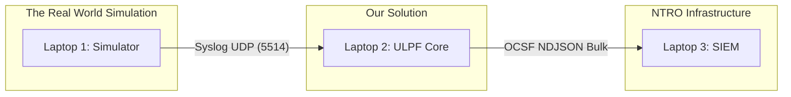

# ULPF 3-Laptop Demo Setup Guide

This guide explains how to set up the Universal Log Pre-processing Framework (ULPF) for a realistic, production-like demonstration using three separate laptops connected over a local network.

This architecture proves that the ULPF correctly sits between raw log sources and a downstream SIEM without requiring internet connectivity (air-gapped deployment).

## Architecture Overview



*   **Laptop 1 (Source Simulator):** Generates real-world log traffic (FortiGate, Cisco ASA, Snort, etc.) using our pre-recorded dataset library.
*   **Laptop 2 (ULPF Engine):** Runs the ULPF core engine. It receives syslog, identifies formats, normalizes them to OCSF, maintains the integrity vault, and serves the Analyst Dashboard.
*   **Laptop 3 (SIEM):** Runs a standard SIEM (Wazuh or OpenSearch) to receive the cleaned OCSF data, proving seamless integration.

## Network Prerequisites

1.  Connect all three laptops to the **same local network** (e.g., an Ethernet switch or a dedicated Wi-Fi hotspot).
2.  **No internet connection is required.** ULPF is fully air-gapped.
3.  Assign static IP addresses if possible, or note the assigned IPv4 addresses:
    *   Laptop 1 IP: `192.168.1.101`
    *   Laptop 2 IP: `192.168.1.102`
    *   Laptop 3 IP: `192.168.1.103`
4.  Ensure firewalls on Laptop 2 and 3 allow inbound traffic on the required ports (see below).

---

## Laptop 3: The SIEM (Wazuh/OpenSearch) Setup

*Set this up first so it's ready to receive data.*

1.  Install Docker and Docker Compose on Laptop 3.
2.  Clone the ULPF repository:
    ```bash
    git clone https://github.com/your-org/ulpf.git
    cd ulpf/deploy/siem
    ```
3.  Start the single-node OpenSearch/Wazuh stack:
    ```bash
    docker-compose up -d
    ```
4.  Verify it is running by opening a browser on Laptop 3 to `http://localhost:5601` (or whichever port your SIEM dashboard binds to).
5.  Create an index pattern for `ulpf-events-*` to view incoming OCSF data.

---

## Laptop 2: The ULPF Engine Setup

*This is the core of our solution.*

1.  Clone the ULPF repository:
    ```bash
    git clone https://github.com/your-org/ulpf.git
    cd ulpf
    ```
2.  Build the ULPF binary in release mode:
    ```bash
    cargo build --release
    ```
3.  Start the ULPF server, configuring it to forward data to Laptop 3:
    ```bash
    ./target/release/ulpf serve \
      --packs packs \
      --vault data/vault \
      --integrity-dir data/integrity \
      --chain production \
      --opensearch http://192.168.1.103:9200 \
      --opensearch-index ulpf-events \
      --bind 0.0.0.0
    ```
    *Note: The `serve` command now automatically listens for inbound syslog on UDP port 5514.*
4.  Open a browser on Laptop 2 to `http://localhost:8787` to view the Analyst Dashboard.

---

## Laptop 1: The Source Simulator Setup

*This generates the synthetic "real" traffic.*

1.  Clone the ULPF repository (which includes the `testdata/real/` directory):
    ```bash
    git clone https://github.com/your-org/ulpf.git
    cd ulpf
    ```
2.  Build the ULPF binary:
    ```bash
    cargo build --release
    ```
3.  Start the Developer Dashboard (which controls the replay engine):
    ```bash
    ./target/release/ulpf dev-console --port 8787
    ```
4.  Open a browser on Laptop 1 to `http://localhost:8787`.
5.  In the dashboard, configure the **Target IP** to be Laptop 2 (`192.168.1.102`) and the **Port** to `5514`.
6.  Toggle various device sources (e.g., FortiGate, Check Point) to "ON".

---

## The Demo Flow (What to show the Judges)

1.  **Show the Simulator (Laptop 1):** Point out the raw, messy logs from 10 different vendors streaming out over UDP.
2.  **Show the ULPF Engine (Laptop 2):** 
    *   Open the Dashboard. Show the "Live Pipeline" graph.
    *   Show how it instantly recognizes FortiGate vs. Palo Alto.
    *   Explain the **Integrity Vault**: Every raw byte is cryptographically signed and stored before parsing.
3.  **Show the SIEM (Laptop 3):**
    *   Open Kibana/Wazuh.
    *   Search for a unified OCSF field like `src_endpoint.ip: 10.0.0.5`.
    *   Show how a single query returns data from FortiGate, Cisco, AND Snort because ULPF normalized them.
4.  **The "Unknown Device" Scenario:**
    *   On Laptop 1, turn on the "Unknown Custom App" source.
    *   On Laptop 2, show how these logs land safely in the "Unparsed Clusters" queue (Requirement 'c': graceful degradation).
    *   Demonstrate the **Deterministic Pack Generator**: Click "Draft Pack" and show how the system automatically infers a parser schema without dropping a single log.
